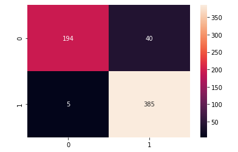

# pneumonia-detector
Little app for detect pneumonia by analyzing an x-ray of the lungs

- You can check the challenge and the dataset used [here](pneumonia_modeling.ipynb)  
- You can follow my development step in the [modeling notebook](pneumonia_challenge.ipynb)


## Data

After a very simple analysis I could notice that there was

For training : 
 - 1341 images of normal lungs
 - 3875 images of lungs with pneumonia (virus or bacteria)

For testing : 
 - 234 images of normal lungs
 - 390 images of lungs with pneumonia (virus or bacteria)

## Accuracy

```
Accuracy: 92
Recall : 98
AUC : 97
```

**Confusion matrix :**



## Docker

For try this app on your computer with docker, just enter this command in your terminal.   
It's magic.

```docker
docker run -p 8501:8501 leersma/pneumo-detect:latest
```
just pay attention to the port used
If you run it on port 8501 as in the example, you can easily access it like this: http://localhost:8501/.

